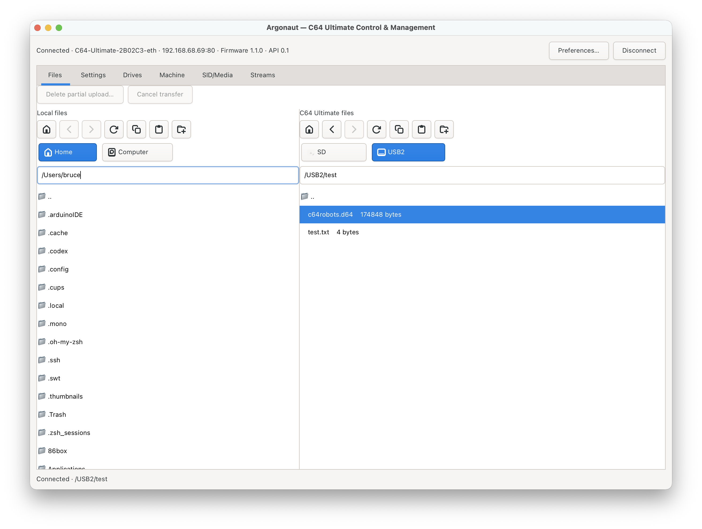
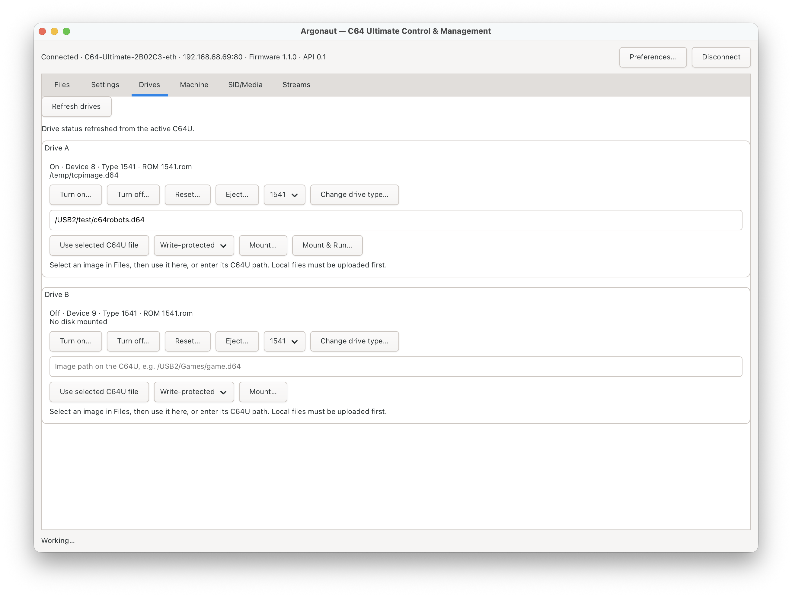
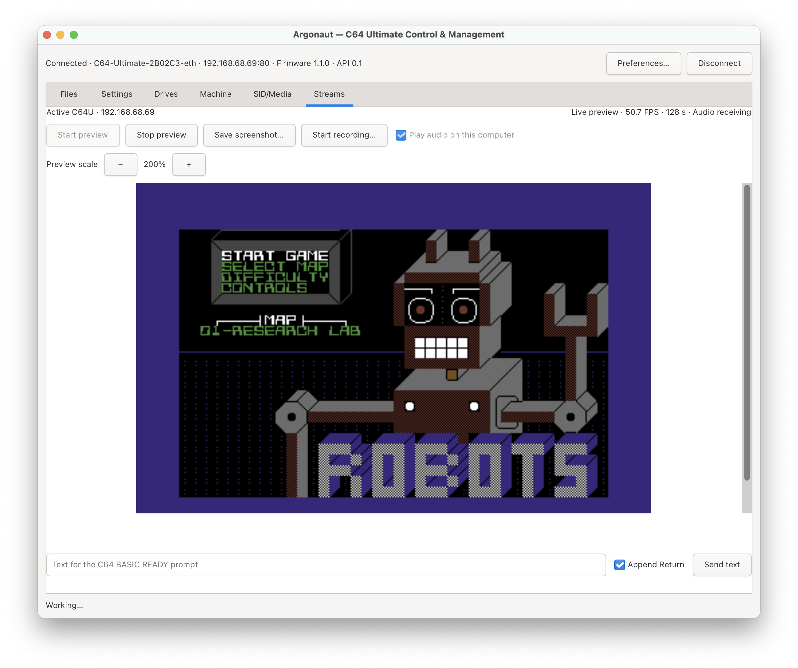
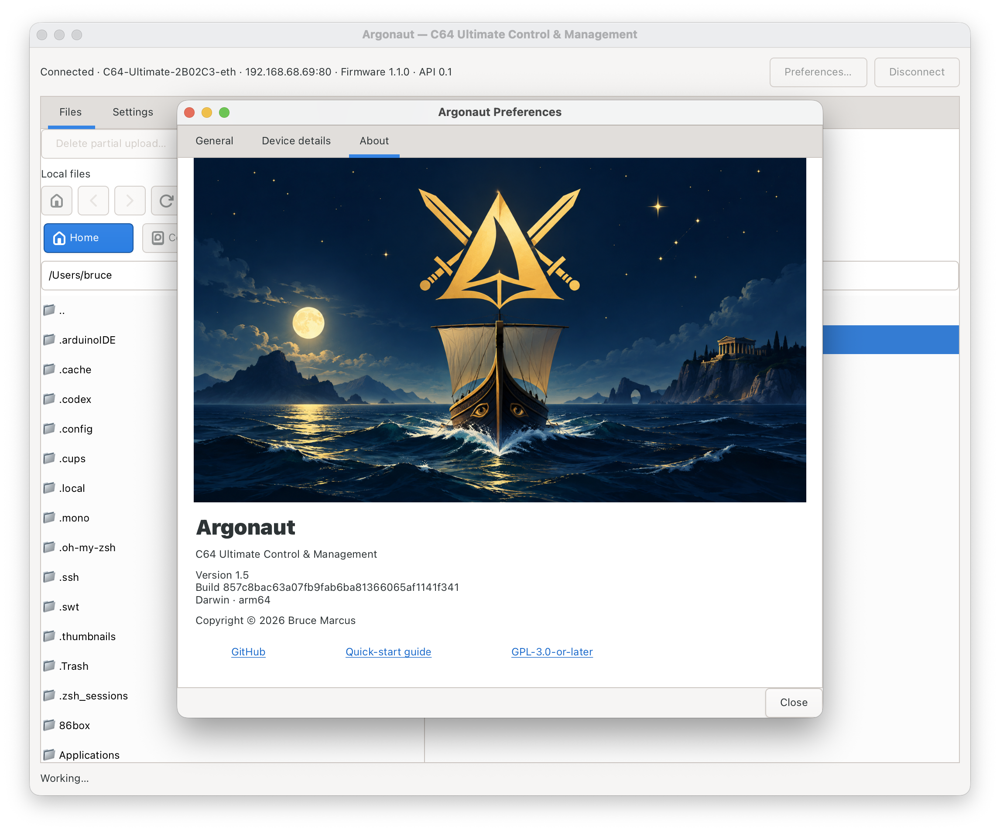

# Argonaut

A GTK desktop application for controlling and managing a Commodore 64 Ultimate.

Features include connection profiles, local and C64U USB/SD file management,
settings and favorites, ROM selection, configuration backups and Undo,
live screen preview, screenshots, and WebM recordings.
Hidden local files and folders are omitted by default. They can be shown from
**Preferences → General** without affecting the C64U file listing.
In Streams, pressing Return sends the current text and leaves an empty focused
field ready for the next C64 command after a successful send.

Start with the [quick-start guide](docs/QUICK-START.md) for connection setup,
file transfers, settings, backups, and preview.

## macOS (Apple Silicon and Intel)

Download the [Mac release](https://github.com/Mrbruceybruce/argonaut-c64u/releases/tag/v1.8)
for **macOS 15 or newer**. Open the DMG and drag Argonaut into Applications.
Choose the Apple Silicon or Intel download for your Mac. The ZIP contains the same app. Python, GTK, and media libraries are included.
Profiles use `~/Library/Application Support/argonaut`; passwords use macOS Keychain.

This build is ad-hoc signed and has not been Apple-notarized. macOS may require
**Privacy & Security → Open Anyway** for the first launch.

## Windows 10/11 (64-bit)

Download the [Windows release](https://github.com/Mrbruceybruce/argonaut-c64u/releases/tag/v1.8):

- **Setup.exe** installs Argonaut for your Windows user, adds a Start menu shortcut,
  and provides an uninstaller. Profiles use AppData; saved passwords use Windows
  Credential Manager.
- **Portable.zip** can be extracted to a writable thumb-drive folder. Keep
  `Argonaut.exe`, `_internal`, and `portable.flag` together. Settings and profiles
  travel in the adjacent `Data` folder; passwords last only for the current session.
  Exit Argonaut before ejecting the drive.

Both include the required runtime and are unsigned. Add the C64U address manually
in Preferences → Device details. See [Windows instructions](packaging/windows/README.txt) for details.

## Debian 13 installation

Download the Debian package from [Releases](https://github.com/Mrbruceybruce/argonaut-c64u/releases/tag/v1.8) and install it with:

```sh
sudo apt install ./argonaut-c64u_1.8_all.deb
```

Launch **Argonaut** from the application menu, or run `argonaut`.
Enable the C64U REST and FTP services, then add its address in **Preferences → Device details**.
Preview requires Ethernet and inbound UDP ports 11000–11001 from the C64U;
configure any firewall to allow only the intended device or trusted LAN.
Installation does not change firewall rules or device settings.

Profiles and preferences use `$XDG_CONFIG_HOME/argonaut` (normally
`~/.config/argonaut`). Saved passwords use the desktop Secret Service.
Removing or upgrading the package preserves user preferences.

Use **Preferences → About** to check the running version and build identifier.

## Screenshots

Argonaut 1.5 running on macOS (Apple Silicon), connected to a C64 Ultimate.

**Files — local and C64U storage side by side.**

Open a D64, D71, or D81 to view its authentic Commodore directory. Standard
35-track D64 images can stage filename changes, file removal, and PRG/SEQ/USR
additions. Argonaut validates the complete result and saves it as a new local
D64; it never rewrites the source image or replaces an existing destination.
REL removal includes its indexed data and side sectors; creating new REL files
is not supported. Standard D71 images use the same staged rename, removal, and
PRG/SEQ/USR addition workflow while validating both 1571 BAM regions.
Use **New D64 disk…** in the local Files toolbar to create a validated blank
35-track image with a C64 disk label and two-character ID. The new image starts
with 664 blocks free and is opened immediately for file additions.
Standard D81 images also support staged rename, ordinary-file removal, and
PRG/SEQ/USR addition while validating both BAM regions.
Authentic 1581 CBM partitions are labeled as disk partitions and are never
presented as ordinary host folders or extractable chained files. Their allocated
sectors remain protected during editing.



**Drives — mount disk images or use Mount & Run.**



**Streams — live C64U screen preview with audio receiving.**



**About — version, build, platform, and project links.**



## Run from source

For Mac source setup and Intel builds, see [macOS build instructions](docs/MACOS-BUILD.md).

On Debian, install Python 3.11+, PyGObject, GTK 4.8+, libsecret introspection,
GStreamer introspection and base/good plugins, iproute2 and Adwaita icons.
The complete Debian dependency list is in `packaging/build_deb.py`.
Run `python3 -m c64u_browser.gui` in a graphical desktop session.

## Build and test

```sh
python3 -m unittest discover -s tests -p 'test_*.py'
python3 -m c64u_browser.test_lab
python3 -m c64u_browser.test_lab --suite hardware  # optional, read-only C64U checks
python3 packaging/build_deb.py --output dist
```

The Test Lab emits structured results for offline checks and opt-in, read-only
C64U checks. See [Test Lab foundation](docs/TEST-LAB.md) for reports, credentials,
and automation exit codes.

See `packaging/RELEASE-NOTES.md` for validation and known limitations.
The [C64U freeze reported during an Undo test involving SuperCPU Detect](https://github.com/Mrbruceybruce/argonaut-c64u/issues/1) remains unresolved.
Other firmware versions may expose different capabilities.

## Feedback

Use the [bug-report or feature-request form](https://github.com/Mrbruceybruce/argonaut-c64u/issues/new/choose)
to report a problem or suggest an improvement. Bug reports should include your
OS, Argonaut package version, C64U firmware, and steps to reproduce.

## License

Copyright (C) 2026 Bruce Marcus. Licensed under **GPL-3.0-or-later**.
See [LICENSE](LICENSE) and [COPYRIGHT](COPYRIGHT). No firmware, ROMs,
third-party disk images, credentials, or device scan results are included.
